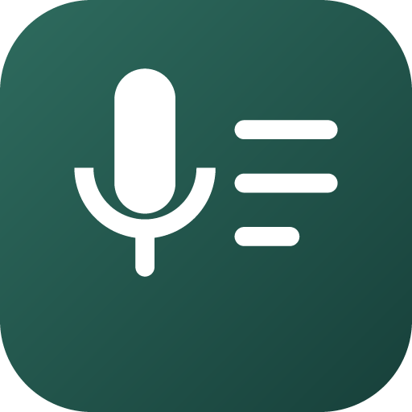

<p align="center">
  
</p>

<h1 align="center">Scribe</h1>

<p align="center">
  Tap a home-screen widget, record the meeting, get a timestamped transcript.<br>
  Everything runs on the phone. No audio ever leaves the device.
</p>

---

## What it does

You are on a call on your laptop. You put your phone next to it and tap one widget.
Scribe records the room, and when you tap stop it turns that audio into a transcript —
line by line, each with a timestamp, each individually shareable.

There is no account, no upload, and no network call except the one-time model download.

**Why not the recorder app already on your phone?** Because it hands you a wall of text
with no idea that four people were in the room. Scribe separates the voices, so the
transcript says who spoke, and a **Conversation** view says who spoke for how long, who
asked the questions and who talked over whom. All of it on the phone, with nothing
uploaded — not because a server would be hard, but because a meeting recording should
only ever exist in one place. [docs/INTELLIGENCE.md](docs/INTELLIGENCE.md) has the long
version, including what we deliberately do *not* claim.

**Stage 1 (this repo, today): audio → text.**
**Stage 2 (deliberately out of scope for v0.1): summaries and action points**, produced by
whatever model or agent you like, from the JSON transcript Scribe exports. See
[docs/PLAN.md](docs/PLAN.md) for why the split exists.

## Install

Grab the APK from [Releases](../../releases) and sideload it on an arm64 Android phone
(Android 10 / API 29 or newer). Built and tested against a Pixel 9.

On first launch:

1. Tap **Download model** — about 615 MB total (two models: a small streaming one for the
   live preview, and the large accurate one), once, over Wi-Fi.
2. Grant the microphone permission.
3. Long-press your home screen → **Widgets** → **Scribe** → drop the 1×1 tile somewhere reachable.

You can record before the model finishes downloading. The audio waits on disk and
transcribes itself once the model is there.

## Using it

- **Tap the widget** to start. The tile turns red and a notification shows the elapsed time,
  with a live, rough preview of the transcript as it picks up the room.
- **Tap it again** to stop. The accurate transcription pass starts by itself and replaces
  the live preview once it's done.
- Open a meeting to read the transcript. Tap the share icon on any line to send just
  that line. The overflow menu shares the whole transcript as `.txt`, exports it as
  Markdown, `.json`, `.srt` or `.vtt`, or copies it **ready for a chatbot** — the
  transcript with a summarise-and-cite prompt already attached, so handing a meeting
  to a model is one paste rather than a paste and a retyped prompt.
- **Speaker labels** appear above a line when the voice changes, once you have turned
  speaker separation on in Settings (an extra 36 MB download, also offline). Tap a label
  to name that voice; the name applies to every line they spoke and follows the
  transcript into every export. The overflow menu's **Conversation** shows talk time,
  turns, questions and interruptions per speaker.
- **Settings** (the gear, top right) holds your data: export the whole library as a
  single backup file, restore one, decide whether recordings are deleted once they have
  been transcribed, and check which build you are running.

The transcript you keep is always produced by the **accurate** pass, which runs **after**
the meeting, not during it. That is on purpose: it keeps the phone cool while recording,
lets the recognizer take its time, and means a crash in the recognizer can never cost you
audio. The live preview shown during recording is a disposable scaffold — it's there so
you can see the phone is actually hearing the room while you can still move it, not to be
the transcript itself.

### Backups

Settings → **Export a backup** writes your whole library as one `.zip` — a manifest of
every meeting and transcript, optionally with the recordings alongside. It asks which,
because transcripts on their own are kilobytes and the same archive with audio is
hundreds of megabytes.

**Restore a backup** reads one back. Restoring is **additive**: meetings are added to
what is already on the phone and nothing is replaced, so picking the wrong file cannot
cost you anything. That also makes the backup the way to move a library between phones —
and, in time, to a Mac: it is the interchange format [docs/MACOS.md](docs/MACOS.md)
builds on.

There is no cloud backup, because there is no cloud. If you want a copy, you make one.

### Speakers

Settings → **Identify speakers** downloads two more models (36 MB, once, offline like
everything else). After that, each new recording is split into distinct voices as part of
the same pass that transcribes it.

It finds *voices*, not people. There is no voiceprint database and nothing identifies
anybody — you get "Speaker 1" and "Speaker 2" until you type a name, and the names stay
on that one meeting. Speaker separation can also simply be wrong, which is why the
Conversation view says so and every number in it can be checked against the transcript.

Because it reads the waveform, it runs **before** the audio is deleted, in the same pass
as transcription. The consequence is that meetings transcribed before you turned it on
cannot be relabelled — their audio is already gone.

## How it works

```
widget tap
   └─ RecordTrampolineActivity        (satisfies Android 14+ FGS-from-background rules)
        └─ RecorderService            foreground service, type=microphone
             └─ 16 kHz mono PCM16, rotating 30-second segments on disk
                  │                              │
                  │ (disk only)                  │ (same buffers, own thread, bounded queue)
                  ▼                              ▼
             TranscribeWorker              LiveTranscriber
             WorkManager, resumable        StreamingEngine → 20M zipformer int8
             segment by segment            on-screen preview while recording; drops
                  │                        audio under load rather than blocking it
                  ▼
             ParakeetEngine   sherpa-onnx → Parakeet TDT 0.6B v3 int8
                  └─ SQLite: clears the live preview lines, writes its own
```

| Piece | Choice | Why |
|---|---|---|
| Accurate ASR model | [Parakeet TDT 0.6B v3](https://github.com/k2-fsa/sherpa-onnx) int8 | 6.34% WER vs Whisper large-v3's 7.44%, at a fraction of the size |
| Live preview model | streaming zipformer, 20M params, int8 | Small and fast enough to decode while still recording; a disposable preview, not the kept transcript |
| Runtime | [sherpa-onnx](https://github.com/k2-fsa/sherpa-onnx) prebuilt AAR | ONNX Runtime + a tested TDT decoder; no NDK toolchain needed to build this repo |
| Audio | 16 kHz mono PCM16, 30 s segments | ~115 MB/hour, and a segment is the unit of resumable work |
| Storage | Hand-written `SQLiteOpenHelper` | Two tables; Room's codegen is not worth the build surface |
| UI | Views + ViewBinding, Material 3 dark theme | Smaller, faster to build, fewer moving parts at v0.1 |

Recording and transcription are coupled **only through the disk**. If the recognizer runs
out of memory, the PCM files are still sitting there and the job picks up at the segment
it last committed — it does not restart an hour of work. The live preview reads the same
audio buffers non-destructively; if it falls behind and drops audio, the disk copy — and
the accurate pass that runs over it after the meeting — is unaffected.

## Building it yourself

Requires JDK 21 and an Android SDK with platform 35 and build-tools 35.

```bash
git clone https://github.com/vattitude-me/scribe.git
cd scribe
./scripts/setup.sh                                   # fetches the 48 MB sherpa-onnx AAR
echo "sdk.dir=$HOME/Library/Android/sdk" > local.properties
JAVA_HOME=/path/to/jdk-21 ./gradlew :app:assembleDebug
```

The APK lands in `app/build/outputs/apk/debug/`.

### Signing a release build

`assembleRelease` looks for `keystore.properties` at the repo root (git-ignored):

```properties
storeFile=/absolute/path/to/release.keystore
storePassword=…
keyAlias=scribe
keyPassword=…
```

Without that file the release build still assembles — it is simply unsigned and will not
install. The keystore must never change between releases, or Android will refuse the
upgrade and you will have to uninstall first.

## Known limits

- **Headphones defeat it.** If you listen through headphones the phone only hears your
  half of the conversation. There is nothing software can do about that on a phone; use
  the laptop speaker. This is the limitation a Mac app removes, by capturing system audio
  directly — see [docs/MACOS.md](docs/MACOS.md).
- **No speaker labels yet.** Every line is attributed to nobody. Diarization is planned
  (sherpa-onnx ships the models) but is not wired up.
- **Transcription quality is unmeasured** against real meeting audio on a Pixel 9. The
  numbers above are the model author's, not ours.
- **Android only.** The iOS app in [docs/PLAN.md](docs/PLAN.md) was never built, and is no
  longer the plan — iOS cannot capture another app's audio. The second platform is macOS:
  [docs/MACOS.md](docs/MACOS.md), with a working capture spike in [mac/](mac).
- **No process isolation.** The plan calls for running ASR in a `:asr` process so an OOM
  cannot take the recorder down; today it shares the main process.

## Privacy

Audio and transcripts live in the app's private storage. `allowBackup` is off, so nothing
is copied into a Google backup. The only network traffic the app generates is the model
download from GitHub.

Recording other people has rules that vary by jurisdiction and employer. That part is on you.

## License

MIT
